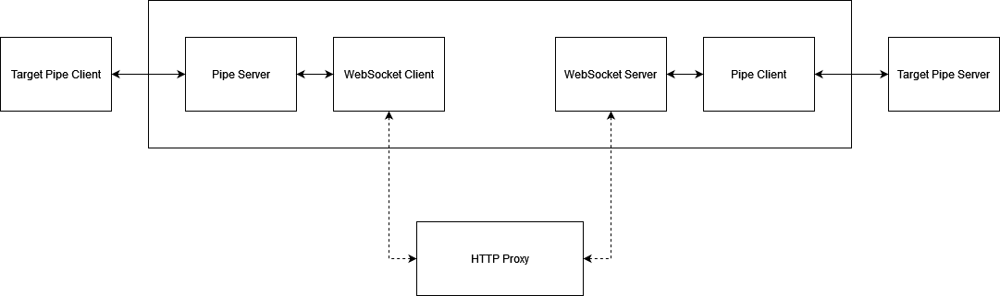
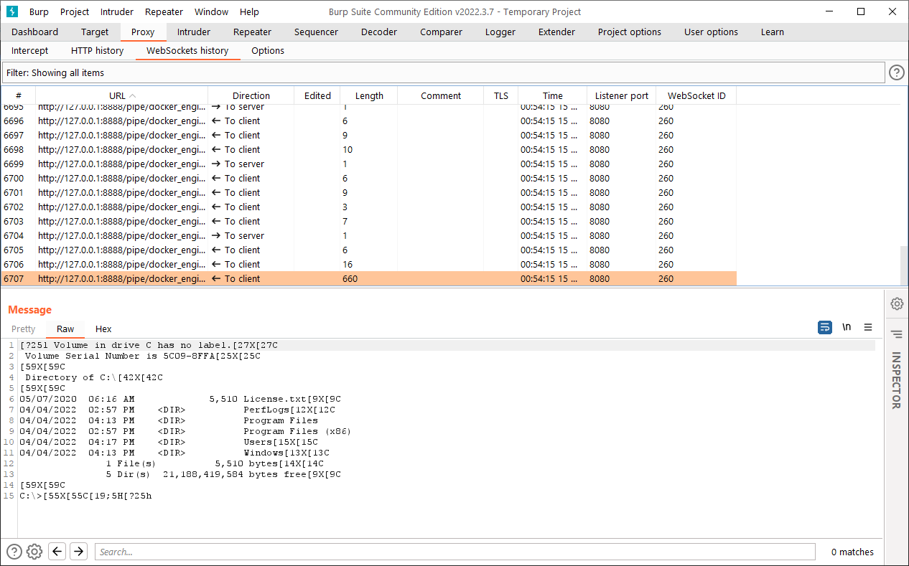
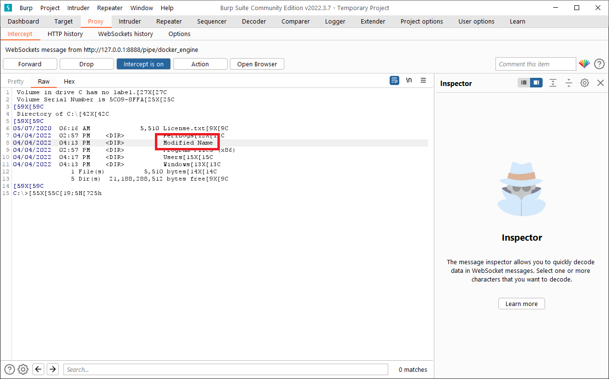

# pipe-intercept
#### Intercept Windows Named Pipes communication using Burp or similar HTTP proxy tools
Named Pipes are very popular for interprocess communication on Windows. They are used in many applications, including Windows Remote Procedure Call (RPC). The purpose of this tool is to allow security researchers and pentesters to perform security assessment for applications that use named pipes.
This project is inspired by the amazing [MITM_Intercept](https://github.com/cyberark/MITM_Intercept) project from CyberArk Labs.
### How Does it Work?
The tool creates a pipe client/server proxy with a WebSocket client/server bridge. The WebSocket client connects to the WebSocket server through a proxy such as Burp.

**Important note:** This tool uses win32 api to create the named pipes, so it only works on Windows. Currently it needs to run on the same machine as the target pipe server and the HTTP proxy. I might add an option to use a remote proxy, and an option to relay to a remote pipe server, but the tool will still have to run on Windows.

Flow diagram:



It's important to understand that this tool works by creating separate pipe server instances, apart from the instances created by the target server application, making the target client application connect to these proxy instances. This means a few things:
1. If the tool runs after the target server application has started and created its pipe server instances, the user running the tool must have enough permissions to create pipe server instances
2. Usually, a server application will always have one pipe server instance waiting for a client connection. Clients connect in FIFO order so it's possible that after you run the tool, the first client will connect to the instance created by the target application, and the next clients will start going through the proxy. Some applications might behave differently, they might not have a listening instance all the time, or they might even have more than one - at the moment you will need to try and understand how your target application works
3. Some applications will check the pipe client/server on the other end (by process ID, username etc.) and use it as an authentication method. In these cases the tool might not work
4. In case the tool creates the first pipe server instance, the target server application might fail to start (if it uses FILE_FLAG_FIRST_PIPE_INSTANCE)

As you can see from the items above, using this tool could change the behavior of the target application. Please remember that this tool is primarily for security testing, do not use it in production systems.
### Dependencies
The tool was tested with Python versions 3.10.2 and 3.10.4. To install the dependencies:
```
pip install -r requirements.txt
```
### Usage
```
usage: pipe_intercept.py [-h] --pipe-name PIPE_NAME --ws-port WS_PORT --http-proxy-port HTTP_PROXY_PORT [--log-level {CRITICAL,ERROR,WARNING,INFO,DEBUG}]

options:
  -h, --help            show this help message and exit
  --pipe-name PIPE_NAME
                        The name of the pipe to be intercepted
  --ws-port WS_PORT     An available port number for the internal WebSocket server
  --http-proxy-port HTTP_PROXY_PORT
                        The port number of the HTTP proxy
  --log-level {CRITICAL,ERROR,WARNING,INFO,DEBUG}
```
### Example
Docker on Windows uses a named pipe to communicate between the client and the docker service. The pipe name is "\\\\.\pipe\docker_engine". Let's see how we can intercept this communication. We start by running the tool:
```
C:\pipe-intercept>python pipe_intercept.py --pipe-name docker_engine --ws-port 8888 --http-proxy-port 8080

INFO:websockets.server:server listening on 0.0.0.0:8888
INFO:websockets.server:server listening on [::]:8888
```
Now we can start Burp, and from another shell create a Windows container:
```
C:\pipe-intercept>docker run -it --name win mcr.microsoft.com/windows:1809-amd64 cmd

Microsoft Windows [Version 10.0.17763.2803]
(c) 2018 Microsoft Corporation. All rights reserved.

C:\>dir
 Volume in drive C has no label.
 Volume Serial Number is 5C09-8FFA

 Directory of C:\

05/07/2020  06:16 AM             5,510 License.txt
04/04/2022  02:57 PM    <DIR>          PerfLogs
04/04/2022  04:13 PM    <DIR>          Program Files
04/04/2022  02:57 PM    <DIR>          Program Files (x86)
04/04/2022  04:17 PM    <DIR>          Users
04/04/2022  04:13 PM    <DIR>          Windows
               1 File(s)          5,510 bytes
               5 Dir(s)  21,188,812,800 bytes free

C:\>
```
Now if we open the WebSocket tab in Burp, we can see the communication:



We can also turn interception on and change the message:



```
Microsoft Windows [Version 10.0.17763.2803]
(c) 2018 Microsoft Corporation. All rights reserved.

C:\>dir
 Volume in drive C has no label.
 Volume Serial Number is 5C09-8FFA

 Directory of C:\

05/07/2020  06:16 AM             5,510 License.txt
04/04/2022  02:57 PM    <DIR>          PerfLogs
04/04/2022  04:13 PM    <DIR>          Modified Name
04/04/2022  02:57 PM    <DIR>          Program Files (x86)
04/04/2022  04:17 PM    <DIR>          Users
04/04/2022  04:13 PM    <DIR>          Windows
               1 File(s)          5,510 bytes
               5 Dir(s)  21,188,288,512 bytes free

C:\>
```
